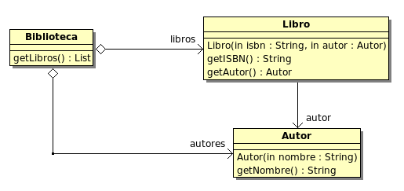

# 2. Patrones de diseño GoF (I)

## Objetivos

Comprender y saber aplicar patrones de diseño GoF (*Gang of Four*) para refactorizar y diseñar soluciones software.

## Antes de empezar

Abre la carpeta **raíz** del repositorio en VSCode (con Java 21 y *Extension Pack for Java* instalados; ver [Entorno de trabajo](../README.md#entorno-de-trabajo)). VSCode detectará automáticamente los proyectos Maven `1_SOLID` y `2_GOF`.

Para ejecutar el código del Ejercicio 1 usa el botón *Run* de VSCode sobre `JuegoEstrategia` o, desde la carpeta `2_GOF`, el comando:

```bash
mvn compile exec:java -Dexec.mainClass=ejercicio1.JuegoEstrategia
```

## Ejercicio 1. Juego de estrategia

### La aplicación

Se desea implementar un juego de estrategia en el que existen dos **tipos de soldado** —el *zapador* (pone bombas) y el *artillero* (dispara)— y dos **familias** de soldados: los Atreides y los Harkonnen. Los jugadores pueden ser humanos o máquina; ambos heredan de `Jugador`, que declara el método abstracto `jugar()`.

Cada jugador crea en su constructor un ejército inicial formado por 2 artilleros y 2 zapadores (dos listas, una por tipo de soldado), todos de la misma familia. Además, en fases posteriores del juego puede crear más soldados desde `jugar()`; por ejemplo, el jugador humano lo hace con las opciones `a` (*crear artillero*) y `z` (*crear zapador*).

Se dispone de una implementación en `src/main/java/ejercicio1`, cuya clase principal es `JuegoEstrategia`. El código contiene dos puntos marcados con el comentario `[PUNTO DE REFACTORIZACION]`.

### Tareas

1. Analiza el código fuente proporcionado y elabora el diagrama de clases de la versión actual.
2. Refactoriza la implementación aplicando un patrón GoF para que:
   - añadir una nueva familia de soldados no afecte a la clase `Jugador` ni a sus subclases;
   - los jugadores no tengan que instanciar clases concretas (por ejemplo, `new ArtilleroAtreides()`), sino que deleguen la creación de los soldados;
   - un mismo jugador no pueda mezclar soldados de familias distintas.
3. Elabora el diagrama de clases de la versión refactorizada y justifica brevemente el patrón elegido.

> **Importante**: la refactorización no debe cambiar el comportamiento observable del juego. `JugadorHumano` debe seguir pidiendo las acciones `d`, `b`, `a` y `z`, y `JugadorMaquina` debe seguir disparando y poniendo bombas.

## Ejercicio 2. Importador a biblioteca

Se desea crear una aplicación capaz de importar una serie de libros a partir de un fichero de texto con un libro por línea y los campos separados por tabuladores:

```text
LIBRO<TABULADOR>AUTOR<TABULADOR>ISBN
```

Un ejemplo de entrada está en [libros.txt](libros.txt).

Los libros deben importarse a una estructura de objetos como la del siguiente diagrama de clases:



*Diagrama de clases del modelo de biblioteca.*

También se contempla la posibilidad de transformar ese mismo fichero de texto en otra representación: un fichero XML con la forma:

```xml
<libros>
	<libro>
		<titulo>El quijote</titulo>
		<autor>Cervantes</autor>
		<isbn>2222</isbn>
	</libro>
	<libro>
		<titulo>Cien años de soledad</titulo>
		<autor>García Márquez</autor>
		<isbn>3333</isbn>
	</libro>
</libros>
```

### Tareas

1. Diseña el sistema aplicando el/los patrón/es de diseño GoF que consideres más adecuados, teniendo en cuenta que se desean construir **dos representaciones distintas** (la `Biblioteca` en memoria y el XML) y que el algoritmo de creación es el mismo en ambos casos: una iteración que va añadiendo libros, independiente de la representación final. **Nota**: se pueden añadir métodos a las clases del diagrama (sobre todo a `Biblioteca`).
2. Elabora el diagrama de clases de tu solución y justifica brevemente el patrón o patrones elegidos.
3. Implementa el sistema en Java, en el paquete `ejercicio2`. El `main`, sin interacción con el usuario, debe leer el fichero `libros.txt`, crear la estructura `Biblioteca` en memoria y, después, **volver a leer el fichero** y crear el fichero `libros.xml`, como si fuesen dos rutinas independientes.
