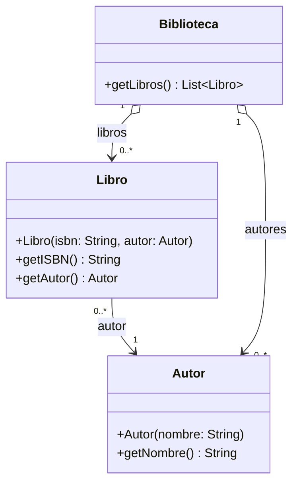
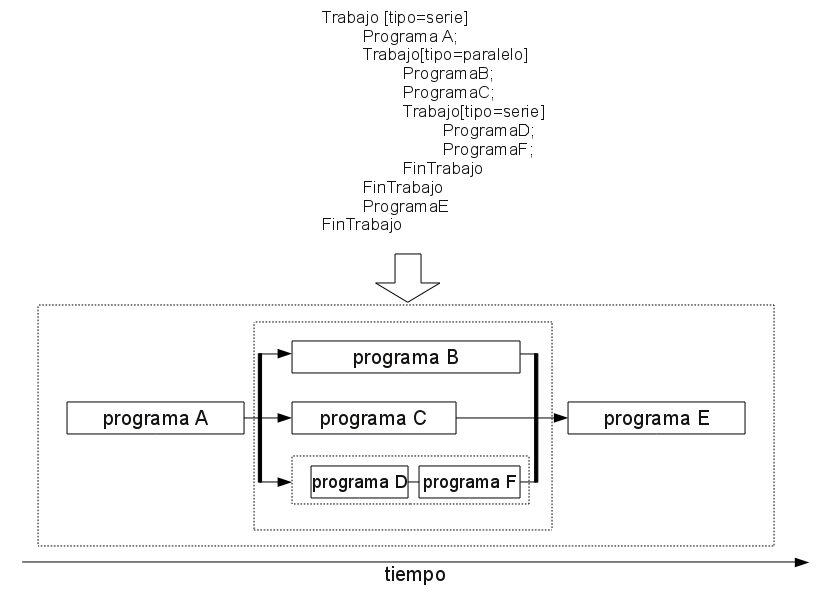

# 2. Patrones de diseño GoF (I)

## Objetivos

Comprender y saber aplicar patrones de diseño GoF (*Gang of Four*) para refactorizar y diseñar soluciones software.

## Antes de empezar

Abre la carpeta **raíz** del repositorio en VSCode (con Java 21 y *Extension Pack for Java* instalados; ver [Entorno de trabajo](../README.md#entorno-de-trabajo)). VSCode detectará automáticamente los proyectos Maven `1_SOLID` y `2_GOF`.

Para ejecutar el código usa el botón *Run* de VSCode sobre la clase con `main` correspondiente o, desde la carpeta `2_GOF`, el comando:

```bash
# Ejercicio 1
mvn compile exec:java -Dexec.mainClass=ejercicio1.JuegoEstrategia

# Ejercicio 2 (una vez implementado)
mvn compile exec:java -Dexec.mainClass=ejercicio2.Main

# Ejercicio 3
mvn compile exec:java -Dexec.mainClass=ejercicio3.Main

# Ejercicio 4
mvn compile exec:java -Dexec.mainClass=ejercicio4.Main
```

## Ejercicio 1. Juego de estrategia

### La aplicación

Se desea implementar un juego de estrategia en el que existen dos **tipos de soldado** —el *zapador* (pone bombas) y el *artillero* (dispara)— y dos **familias** de soldados: los Atreides y los Harkonnen. Los jugadores pueden ser humanos o máquina; ambos heredan de `Jugador`, que declara el método abstracto `jugar()`.

Cada jugador crea en su constructor un ejército inicial formado por 2 artilleros y 2 zapadores (dos listas, una por tipo de soldado), todos de la misma familia. Además, en fases posteriores del juego puede crear más soldados desde `jugar()`; por ejemplo, el jugador humano lo hace con las opciones `a` (*crear artillero*) y `z` (*crear zapador*).

Se dispone de una implementación en `src/main/java/ejercicio1`, cuya clase principal es `JuegoEstrategia`. El código contiene dos puntos marcados con el comentario `[PUNTO DE REFACTORIZACION]`.

### Tareas

1. Analiza el código fuente proporcionado y elabora el diagrama de clases de la versión actual.
2. Refactoriza la implementación aplicando un patrón GoF para que:
   - añadir una nueva familia de soldados no afecte a la clase `Jugador` ni a sus subclases;
   - los jugadores no tengan que instanciar clases concretas (por ejemplo, `new ArtilleroAtreides()`), sino que deleguen la creación de los soldados;
   - la familia se elija una única vez (por ejemplo, en `main`) y el jugador la reciba ya resuelta, sin que este conozca las clases concretas;
   - un mismo jugador no pueda mezclar soldados de familias distintas.
3. Elabora el diagrama de clases de la versión refactorizada y justifica brevemente el patrón elegido.
4. Añade una tercera familia (los Corrino), con sus dos tipos de soldado, y comprueba que no has necesitado modificar ni `Jugador` ni sus subclases.

> **Importante**: la refactorización no debe cambiar el comportamiento observable del juego. `JugadorHumano` debe seguir pidiendo las acciones `d`, `b`, `a` y `z`, y `JugadorMaquina` debe seguir disparando y poniendo bombas.

## Ejercicio 2. Importador a biblioteca

Se desea crear una aplicación capaz de importar una serie de libros a partir de un fichero de texto con un libro por línea y los campos separados por tabuladores:

```text
LIBRO<TABULADOR>AUTOR<TABULADOR>ISBN
```

Un ejemplo de entrada está en [libros.txt](libros.txt).

Los libros deben importarse a una estructura de objetos como la del siguiente diagrama de clases:



También se contempla la posibilidad de transformar ese mismo fichero de texto en otra representación: un fichero XML con la forma:

```xml
<libros>
	<libro>
		<titulo>El quijote</titulo>
		<autor>Cervantes</autor>
		<isbn>2222</isbn>
	</libro>
	<libro>
		<titulo>Cien años de soledad</titulo>
		<autor>García Márquez</autor>
		<isbn>3333</isbn>
	</libro>
</libros>
```

> **Nota**: la representación XML se puede generar **volcando directamente** el fichero (streaming), sin necesidad de mantener la estructura de objetos en memoria. Por tanto, los autores pueden aparecer repetidos y no es necesario deduplicarlos.

Se proporciona un esqueleto de las clases del modelo (`Autor`, `Libro` y `Biblioteca`) y de la clase principal (`Main`) en `src/main/java/ejercicio2`. Puedes añadir los métodos que necesites, sobre todo a `Biblioteca`.

### Tareas

1. Diseña el sistema aplicando el/los patrón/es de diseño GoF que consideres más adecuados, teniendo en cuenta que se desean construir **dos representaciones distintas** (la `Biblioteca` en memoria y el XML) y que el algoritmo de creación es el mismo en ambos casos: una iteración que va añadiendo libros, independiente de la representación final. **Nota**: se pueden añadir métodos a las clases del diagrama (sobre todo a `Biblioteca`).
2. Elabora el diagrama de clases de tu solución y justifica brevemente el patrón o patrones elegidos.
3. Completa el esqueleto proporcionado e implementa el sistema en Java, en el paquete `ejercicio2`. El `main`, sin interacción con el usuario, debe leer el fichero `libros.txt`, crear la estructura `Biblioteca` en memoria y, después, **volver a leer el fichero** y crear el fichero `libros.xml`, como si fuesen dos rutinas independientes.

## Ejercicio 3. Ejecución de trabajos en un cluster

Se desea crear un sistema genérico para la ejecución de trabajos en un cluster de computación (entendemos *cluster* simplemente como un equipo que tiene un número considerable de procesadores y donde es factible lanzar muchos hilos simultáneamente). Los trabajos están compuestos de programas, que son los que ejecutan tareas atómicas. Además, los trabajos pueden estar, a su vez, divididos en trabajos de forma recursiva. Los trabajos pueden ejecutar sus subtrabajos en serie o en paralelo, es decir:

- **Trabajo en serie**: ejecuta cada uno de sus subtrabajos uno tras otro.
- **Trabajo en paralelo**: lanza todos los subtrabajos en un hilo separado. Para que el trabajo termine, todos sus subtrabajos deberán haber terminado.

Por ejemplo, supongamos que hay implementados 6 programas básicos (`A`, `B`, `C`, `D`, `E`, `F`). El usuario desea ejecutarlos en el cluster siguiendo la siguiente disposición:



*Ejemplo de pipeline de procesamiento con varios procesos.*

Como se puede observar en la figura anterior, un trabajo se puede ver como un árbol. De hecho, la descripción textual del trabajo podría ser un buen fichero de configuración que el usuario aportaría al sistema (no hay que implementarlo).

Los distintos programas están implementados en distintas clases que implementan la interfaz `Runnable`. Por ejemplo, el programa `A` está definido así:

```java
public class ProgramaA implements Runnable {

	public void run() {
		try {
			System.out.println("[INICIO] ProgramaA");
			Thread.sleep(10);
			System.out.println("[FIN] ProgramaA");
		} catch (InterruptedException e) {
			throw new RuntimeException(e);
		}
	}
}
```

### Información Java útil

- Para ejecutar un `Runnable` en nuestro propio hilo, simplemente llamamos a su método `run()`.
- Para lanzar un nuevo hilo en segundo plano que ejecute un `Runnable`:

```java
Thread miRunnableThread = new Thread(miRunnable);
miRunnableThread.start();
```

- Y para esperar a que termine:

```java
miRunnableThread.join();
```

Se proporciona un esqueleto en `src/main/java/ejercicio3` con los seis programas (`ProgramaA`, `ProgramaB`, `ProgramaC`, `ProgramaD`, `ProgramaE` y `ProgramaF`) y la clase principal (`Main`). El diseño de los trabajos y su ejecución en serie o en paralelo debes implementarlo tú.

### Tareas

1. Diseña el sistema empleando el/los patrones GoF que consideres adecuados, teniendo en cuenta que los trabajos se podrán combinar de forma distinta (según el fichero de configuración) y que tanto la ejecución de un trabajo como la de un programa se debe realizar invocando el método `run()`.
2. Elabora el diagrama de clases de tu solución y justifica brevemente el patrón elegido.
3. Completa el esqueleto proporcionado en el paquete `ejercicio3` e implementa un `main` que cree en memoria la estructura del trabajo de la figura y la ejecute. Debe salir por pantalla la salida de cada programa; por ejemplo:

```text
[INICIO] ProgramaA
[FIN] ProgramaA
[INICIO] ProgramaB
[INICIO] ProgramaC
[INICIO] ProgramaD
[FIN] ProgramaD
[INICIO] ProgramaF
[FIN] ProgramaF
[FIN] ProgramaC
[FIN] ProgramaB
[INICIO] ProgramaE
[FIN] ProgramaE
```

Según el trabajo propuesto por la figura, se debe cumplir:

- `ProgramaA` debe finalizar antes de que empiece ningún otro.
- `ProgramaF` debe comenzar después de que finalice `ProgramaD`.
- `ProgramaE` debe comenzar después de finalizar los programas `B`, `C`, `D` y `F`.

## Ejercicio 4. Cálculo de nóminas

Se desea implementar un módulo que calcula las nóminas de los empleados de una empresa (en un planeta donde no existen los impuestos). Los empleados de una empresa tienen una escala que define su salario base (escala C = 900 €, escala B = 1100 €, escala A = 1300 €). Además, los empleados tienen diversos complementos. Algunos de los complementos dependen de la antigüedad, como son los sexenios (cada 6 años, +50 € en la nómina), los quinquenios (cada 5 años, +20 € en la nómina) y los trienios (cada 3 años, +10 € en la nómina). Por otra parte, existen otros complementos, como haber participado en cargos de gestión de la empresa, lo que añade 15 € más de forma vitalicia.

La base de datos de empleados es un fichero con el siguiente formato:

```text
NOMBRE<TABULADOR>ESCALA<TABULADOR>AÑOS_TRABAJADOS<TABULADOR>CARGO_GESTION(SI/NO)
```

Un fichero de ejemplo está en [empleados.txt](empleados.txt):

```text
JUAN	A	10	SI
PEPE	B	25	NO
```

Se proporciona un esqueleto en `src/main/java/ejercicio4` con la escala (`Escala`), los datos del empleado (`Empleado`), un lector del fichero (`LectorEmpleados`) y la clase principal (`Main`). El cálculo de la nómina y sus complementos debes diseñarlo tú.

### Tareas

1. Diseña el sistema empleando el/los patrones GoF que consideres adecuados, teniendo en cuenta que: 1) es posible que se añadan distintos complementos en el futuro, 2) se desea evitar una explosión de clases para cada una de las posibles combinaciones a la hora de calcular una nómina, 3) el código que genera las órdenes de pago al banco no debe verse afectado porque una nómina tenga más o menos complementos (simplemente quiere poder calcular el total de cada empleado) y 4) cada empleado puede acumular un número distinto de complementos, por lo que la composición no puede ser una cadena fija, sino formarse con un número variable de complementos.
2. Elabora el diagrama de clases de tu solución y justifica brevemente el patrón elegido.
3. Completa el esqueleto proporcionado en el paquete `ejercicio4` e implementa un sistema que tome como entrada un fichero como el de ejemplo y saque órdenes de pago; por ejemplo:

```text
JUAN 1435
PEPE 1480
```
