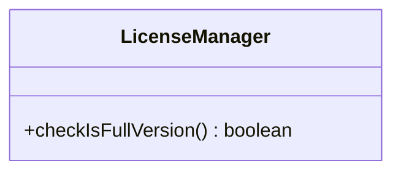

# 3. Patrones de diseño GoF (II)

## Objetivos

Comprender y saber aplicar patrones de diseño GoF para diseñar un framework extensible y para construir una aplicación concreta sobre él.

## Antes de empezar

Abre la carpeta **raíz** del repositorio en VSCode (con Java 21 y *Extension Pack for Java* instalados; ver [Entorno de trabajo](../README.md#entorno-de-trabajo)). VSCode detectará automáticamente el proyecto Maven `3_GOF`.

Para ejecutar el código usa el botón *Run* de VSCode sobre la clase con `main` correspondiente o, desde la carpeta `3_GOF`, el comando:

```bash
# Código de partida (referencia, no lo toques)
mvn compile exec:java -Dexec.mainClass=calculadora.CalculadoraVibeCoding

# Tu solución (por ejemplo)
mvn compile exec:java -Dexec.mainClass=calculadora.Calculadora
```

## Ejercicio 1. Mini-framework de aplicaciones

### La aplicación

Se desea implementar un framework de aplicaciones en modo consola. El framework deberá permitir a sus usuarios (es decir, programadores) añadir una serie de operaciones (dependientes del problema concreto que quieran resolver). Se deben cumplir los siguientes requisitos:

1. Una operación viene definida por un nombre y unos parámetros (un número indeterminado). Cada parámetro tiene también un nombre. Por ejemplo, una operación `sumar` tendría dos parámetros: `sumando A` y `sumando B`. No interesa distinguir el tipo concreto de los parámetros: todos serán de tipo `String`, haciéndose las validaciones oportunas en tiempo de ejecución (por ejemplo, el usuario podría introducir como `sumando A` una cadena no numérica). El valor de retorno de todas las operaciones es también una cadena de texto.
2. El framework mostrará un menú numerado con el nombre de todas las operaciones disponibles (una por línea, con el formato `N. Nombre`, empezando en 1 según el orden en que se registren). La opción `0. Salir` se mostrará siempre en último lugar y será la que termine el programa. El usuario elegirá la opción introduciendo su número y, a continuación, el framework irá pidiendo cada parámetro. Una vez introducidos todos los parámetros, se invocará la operación y, cuando termine, se imprimirá por pantalla el resultado.
3. El framework debe permitir monitorizar el estado de una operación durante su ejecución. Habrá operaciones que duren cierto tiempo, por lo que el programador de las mismas podrá indicar en qué fase están una vez hayan sido invocadas (un porcentaje del tiempo total), para que el usuario sepa si el resultado se obtendrá pronto o no.
4. El framework incluirá un sistema de *logging* que el propio framework usará y también las aplicaciones concretas si así lo deseen. Este sistema de *logging* podrá recibir mensajes con tres niveles de importancia (de menor a mayor: `DEBUG`, `INFO`, `ERROR`) y podrá ser configurado con múltiples destinos (por ahora, fichero de texto o consola). Cada destino de un mensaje de *log* podrá ser configurado con una prioridad mínima: si un mensaje no pasa de la prioridad mínima, no se enviará a ese destino en concreto. El framework deberá enviar un mensaje de *log* cada vez que se ejecute una operación.

### Tareas

1. Diseña el framework empleando el/los patrones GoF que consideres adecuados y elabora el diagrama de clases.
2. Justifica brevemente el patrón o patrones elegidos.
3. Implementa el framework en Java, en el paquete `framework`.

## Ejercicio 2. Mini-framework de aplicaciones II

### La aplicación

Se desea usar el framework del Ejercicio 1 para implementar un pequeño software de cálculo. Tendrá las siguientes operaciones:

- `Suma(a, b)`: suma los parámetros y devuelve el resultado como `String`.
- `Divide(a, b)`: divide los parámetros y devuelve el resultado como `String`.
- `Raíz(a)`: devuelve la raíz cuadrada del parámetro.

Las operaciones se mostrarán en el menú numeradas desde 1 en el orden de la lista anterior, con la opción `0. Salir` en último lugar.

Además, el software tendrá dos versiones: la versión de evaluación y la versión de pago. Para ello, el sistema incorpora una compleja librería anti-copia mediante una clase como la siguiente:



El método `checkIsFullVersion()` devolverá `true` si está en la versión de pago.

En concreto, la operación `Raíz` pertenece a la versión de pago. Si el usuario la solicitase estando en la versión de evaluación (el método devuelve `false`), esta operación debería devolver como resultado `"operación no disponible en la versión de evaluación"`. Todavía no está claro qué opciones estarán disponibles en la versión de pago, por lo que sería interesante no afectar al código de las operaciones por este motivo.

Se proporciona `calculadora.CalculadoraVibeCoding` como referencia funcional: puedes dejarla tal cual, sin modificarla. Crea tu propia clase `calculadora.Calculadora` (por ejemplo; también puede tener otro nombre, pero con su método `main`) sobre el framework del Ejercicio 1. Para ejecutarla usa el botón *Run* de VSCode sobre ella o cambia la clase principal del comando:

```bash
mvn compile exec:java -Dexec.mainClass=calculadora.Calculadora
```

### Tareas

1. Diseña la aplicación concreta empleando el framework del Ejercicio 1 y el/los patrones GoF que consideres adecuados, ampliando el diagrama de clases del Ejercicio 1.
2. Justifica brevemente el patrón o patrones elegidos.
3. Implementa el sistema completo en Java, en el paquete `calculadora`, dentro del **mismo proyecto Maven** `3_GOF` (usa el paquete `framework` como librería, simplemente mediante `import`). `LicenseManager` se implementará de forma sencilla, es decir, el método devolverá `true` o `false` directamente; cambia dicho código para probar que funciona.
4. Añade una nueva operación `Potencia(base, exponente)`, disponible tanto en la versión de evaluación como en la de pago, que devuelva `base` elevado a `exponente` como `String`. Comprueba que añadirla no te ha obligado a modificar el framework.

## Pruebas automáticas (e2e)

El proyecto incluye un test *end-to-end* de la calculadora que simula la interacción por teclado (sin esperar a que alguien escriba) y comprueba la salida por pantalla. Se apoya en JUnit 5 y en la librería [System Stubs](https://github.com/webcompere/system-stubs), que sustituye temporalmente `System.in` y captura `System.out`.

- `AbstractCalculadoraE2ETest` es una clase base que define las pruebas comunes (el menú, `suma`, `divide` y `raiz`) y obtiene el `main` a probar mediante un **Factory Method**.
- `CalculadoraVibeCodingE2ETest` es la subclase que prueba la versión de referencia.

Las entradas se escriben por número, como en el menú (`"1"`, `"2"`, `"3"`, `"0"` para salir).

Para probar tu propia `Calculadora`, crea una subclase como esta:

```java
class CalculadoraE2ETest extends AbstractCalculadoraE2ETest {
	@Override
	protected Consumer<String[]> main() {
		return Calculadora::main;
	}
}
```

Añade ahí los casos nuevos, por ejemplo `Potencia`, y ejecuta los tests con:

```bash
mvn test
```

> **Nota**: el e2e compara la salida con la de `CalculadoraVibeCoding`, así que conserva el formato del menú (`1. Suma`, …) y de los resultados (por ejemplo, `5.0`) para que siga pasando.
